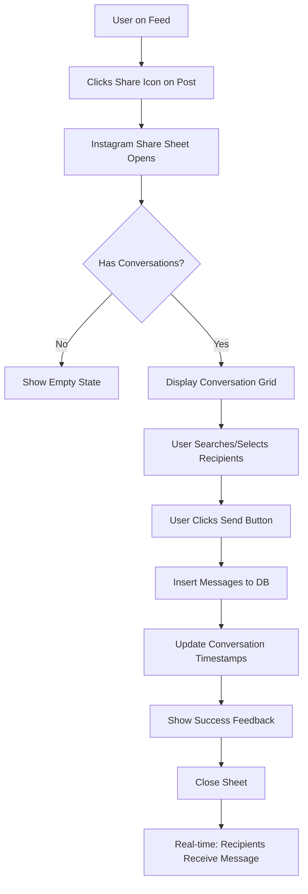
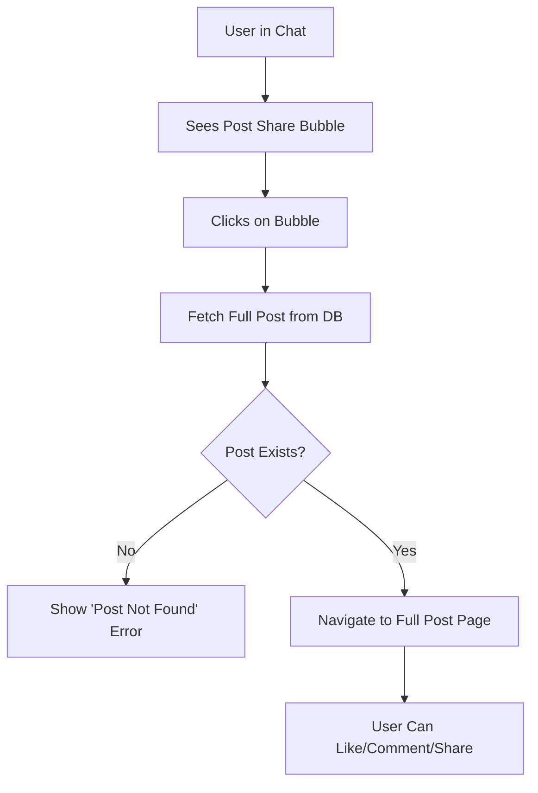
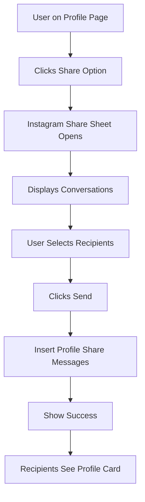

# Rich Message Types & Post/Profile Sharing Feature - Technical Documentation

**Target Platform:** Next.js Web Application
**Source Platform:** Flutter Mobile Application
**Backend:** Supabase (PostgreSQL, Real-time, Storage)
**Last Updated:** 2025-10-05
**Version:** 1.0.0

---

## Table of Contents

1. [Feature Overview](#1-feature-overview)
2. [Database Schema](#2-database-schema)
3. [Message Type System](#3-message-type-system)
4. [API & Data Layer](#4-api--data-layer)
5. [Backend Implementation](#5-backend-implementation)
6. [Frontend Requirements](#6-frontend-requirements)
7. [User Flows](#7-user-flows)
8. [Technical Specifications](#8-technical-specifications)
9. [Security & RLS Policies](#9-security--rls-policies)
10. [Error Handling](#10-error-handling)
11. [Performance Considerations](#11-performance-considerations)

---

## 1. Feature Overview

### 1.1 What This Feature Does

This feature enables users to share **posts** and **user profiles** as rich, interactive message cards within chat conversations. It transforms the messaging experience from plain text to rich media sharing similar to Instagram/WhatsApp.

**Key Capabilities:**
- Share posts from the feed directly into chat conversations
- Share user profiles in messages
- Display rich preview cards with metadata
- Support multi-recipient sharing (Instagram-style)
- Tap on shared content to navigate to full post/profile
- Backward compatibility with legacy text messages

### 1.2 User Experience Flow

#### Sharing a Post:
1. User views a post in their feed
2. Clicks share icon (send/arrow icon next to like button)
3. Instagram-style bottom sheet appears with conversation list
4. User selects one or more recipients
5. Clicks "Send" button
6. Post is shared as a rich message card in selected chats

#### Sharing a Profile:
1. User views another user's profile
2. Clicks share option (three-dot menu → "Share in chat")
3. Same Instagram-style bottom sheet appears
4. User selects recipients and sends
5. Profile is shared as a rich card showing avatar, name, bio

#### Viewing Shared Content:
- **Shared Post:** Displays compact card with author, content snippet, media thumbnail, timestamp. Tapping opens full post.
- **Shared Profile:** Shows avatar, name, username, verification badge, tagline, location. Tapping opens profile page.

---

## 2. Database Schema

### 2.1 Messages Table Structure

The `messages` table has been extended with two new columns to support rich message types:

```sql
CREATE TABLE public.messages (
    id UUID PRIMARY KEY DEFAULT gen_random_uuid(),
    conversation_id UUID NOT NULL REFERENCES public.conversations(id) ON DELETE CASCADE,
    sender_id UUID NOT NULL REFERENCES auth.users(id) ON DELETE CASCADE,
    content TEXT NOT NULL,
    created_at TIMESTAMPTZ DEFAULT NOW(),
    read_at TIMESTAMPTZ,
    is_read BOOLEAN DEFAULT FALSE,
    reply_to_id UUID REFERENCES public.messages(id) ON DELETE SET NULL,
    last_edited_at TIMESTAMPTZ,

    -- NEW COLUMNS FOR RICH MESSAGES
    message_type TEXT DEFAULT 'text'
        CHECK (message_type IN (
            'text',
            'post_share',
            'profile_share',
            'voice_note',
            'image',
            'video',
            'file'
        )),
    metadata JSONB
);

-- Comments for documentation
COMMENT ON COLUMN public.messages.message_type IS
    'Type of message: text, post_share, profile_share, voice_note, image, video, file';
COMMENT ON COLUMN public.messages.metadata IS
    'JSONB metadata for rich message types (post_id, user_id, media_url, etc.)';
```

### 2.2 Column Details

| Column | Type | Required | Description |
|--------|------|----------|-------------|
| `id` | UUID | Yes | Unique message identifier |
| `conversation_id` | UUID | Yes | Foreign key to conversations table |
| `sender_id` | UUID | Yes | User who sent the message |
| `content` | TEXT | Yes | Fallback text content (e.g., "Shared a post") |
| `message_type` | TEXT | No (default: 'text') | Type of message (see enum below) |
| `metadata` | JSONB | No | Rich metadata specific to message type |
| `created_at` | TIMESTAMPTZ | No (default: NOW()) | Message creation timestamp |
| `read_at` | TIMESTAMPTZ | No | When message was read |
| `is_read` | BOOLEAN | No (default: false) | Read status flag |
| `reply_to_id` | UUID | No | ID of message being replied to |
| `last_edited_at` | TIMESTAMPTZ | No | Last edit timestamp |

### 2.3 Related Tables

#### Conversations Table
```sql
CREATE TABLE public.conversations (
    id UUID PRIMARY KEY DEFAULT gen_random_uuid(),
    user1_id UUID NOT NULL REFERENCES auth.users(id) ON DELETE CASCADE,
    user2_id UUID NOT NULL REFERENCES auth.users(id) ON DELETE CASCADE,
    last_message TEXT,
    created_at TIMESTAMPTZ DEFAULT NOW(),
    updated_at TIMESTAMPTZ DEFAULT NOW(),
    status TEXT DEFAULT 'pending' CHECK (status IN ('pending', 'approved', 'rejected')),
    CONSTRAINT different_users CHECK (user1_id <> user2_id),
    CONSTRAINT unique_conversation UNIQUE (user1_id, user2_id)
);
```

#### Posts Table (Referenced in Metadata)
```sql
CREATE TABLE public.posts (
    id UUID PRIMARY KEY,
    author_id UUID REFERENCES public.users(id),
    environment_id UUID REFERENCES public.environments(id),
    content TEXT,
    post_type TEXT CHECK (post_type IN ('text', 'media', 'poll')),
    created_at TIMESTAMPTZ DEFAULT NOW(),
    deleted BOOLEAN DEFAULT FALSE
);
```

#### Users Table (Referenced in Metadata)
```sql
CREATE TABLE public.users (
    id UUID PRIMARY KEY,
    email TEXT UNIQUE,
    username TEXT UNIQUE,
    full_name TEXT,
    avatar_url TEXT,
    tagline TEXT,
    user_type TEXT CHECK (user_type IN ('mentor', 'normal_user')),
    is_verified BOOLEAN DEFAULT FALSE,
    current_city TEXT,
    -- ... other fields
);
```

### 2.4 Database Indexes

```sql
-- Performance indexes for messages
CREATE INDEX IF NOT EXISTS idx_messages_conversation ON public.messages(conversation_id);
CREATE INDEX IF NOT EXISTS idx_messages_sender ON public.messages(sender_id);
CREATE INDEX IF NOT EXISTS idx_messages_created_at ON public.messages(created_at DESC);
CREATE INDEX IF NOT EXISTS idx_messages_type ON public.messages(message_type);

-- GIN index for JSONB metadata queries (optional but recommended)
CREATE INDEX IF NOT EXISTS idx_messages_metadata_gin ON public.messages USING GIN (metadata);
```

---

## 3. Message Type System

### 3.1 Message Type Enum

The system supports the following message types:

| Type | Value (DB) | Status | Description |
|------|-----------|--------|-------------|
| Text | `text` | ✅ Implemented | Standard text messages |
| Post Share | `post_share` | ✅ Implemented | Shared post with preview |
| Profile Share | `profile_share` | ✅ Implemented | Shared user profile |
| Voice Note | `voice_note` | 🚧 Planned | Audio message |
| Image | `image` | 🚧 Planned | Direct image share |
| Video | `video` | 🚧 Planned | Direct video share |
| File | `file` | 🚧 Planned | Document/file share |

### 3.2 Metadata Structure by Type

#### 3.2.1 Text Message
```json
{
  "message_type": "text",
  "content": "Hello, how are you?",
  "metadata": null
}
```

#### 3.2.2 Post Share Message
```json
{
  "message_type": "post_share",
  "content": "Shared a post",
  "metadata": {
    "version": 1,
    "post_id": "550e8400-e29b-41d4-a716-446655440000",
    "author_name": "John Doe",
    "author_username": "johndoe",
    "author_avatar_url": "path/to/avatar.jpg",
    "is_author_verified": true,
    "content": "This is the post content preview...",
    "post_type": "media",
    "media_thumbnail_url": "path/to/thumbnail.jpg",
    "media_count": 3,
    "created_at": "2025-10-05T10:30:00.000Z",
    "environment_name": "Technology",
    "poll_question": null,
    "poll_options": null
  }
}
```

**Post Share Metadata Fields:**

| Field | Type | Required | Description |
|-------|------|----------|-------------|
| `version` | integer | Yes | Metadata schema version (currently 1) |
| `post_id` | string (UUID) | Yes | ID of the shared post |
| `author_name` | string | No | Post author's full name |
| `author_username` | string | No | Post author's username |
| `author_avatar_url` | string | No | Post author's avatar URL |
| `is_author_verified` | boolean | No | Author verification status |
| `content` | string | No | Post text content (preview) |
| `post_type` | string | No | Type: "text", "media", or "poll" |
| `media_thumbnail_url` | string | No | First media item thumbnail |
| `media_count` | integer | No | Total media items count |
| `created_at` | string (ISO) | No | Post creation timestamp |
| `environment_name` | string | No | Category/environment name |
| `poll_question` | string | No | Poll question (if post_type is "poll") |
| `poll_options` | array[string] | No | Poll options list |

#### 3.2.3 Profile Share Message
```json
{
  "message_type": "profile_share",
  "content": "Shared a profile",
  "metadata": {
    "version": 1,
    "user_id": "660e8400-e29b-41d4-a716-446655440001",
    "username": "janedoe",
    "full_name": "Jane Doe",
    "avatar_url": "path/to/avatar.jpg",
    "tagline": "Product Designer | UX Enthusiast",
    "user_type": "mentor",
    "is_verified": true,
    "current_city": "San Francisco"
  }
}
```

**Profile Share Metadata Fields:**

| Field | Type | Required | Description |
|-------|------|----------|-------------|
| `version` | integer | Yes | Metadata schema version (currently 1) |
| `user_id` | string (UUID) | Yes | ID of the shared user |
| `username` | string | No | User's username |
| `full_name` | string | No | User's full name |
| `avatar_url` | string | No | User's avatar URL |
| `tagline` | string | No | User's bio/tagline |
| `user_type` | string | No | "mentor" or "normal_user" |
| `is_verified` | boolean | No | Verification status |
| `current_city` | string | No | User's current location |

#### 3.2.4 Voice Note (Future)
```json
{
  "message_type": "voice_note",
  "content": "Voice note",
  "metadata": {
    "version": 1,
    "audio_url": "path/to/audio.m4a",
    "duration_seconds": 45,
    "waveform_data": [0.2, 0.5, 0.8, ...],
    "file_size_bytes": 102400
  }
}
```

---

## 4. API & Data Layer

### 4.1 Sending a Message with Rich Content

#### 4.1.1 Post Share - API Call

**Endpoint:** `POST /rest/v1/messages`

**Headers:**
```http
Authorization: Bearer <supabase-anon-key>
apikey: <supabase-anon-key>
Content-Type: application/json
Prefer: return=representation
```

**Request Body:**
```json
{
  "id": "770e8400-e29b-41d4-a716-446655440002",
  "conversation_id": "880e8400-e29b-41d4-a716-446655440003",
  "sender_id": "990e8400-e29b-41d4-a716-446655440004",
  "content": "Shared a post",
  "message_type": "post_share",
  "metadata": {
    "version": 1,
    "post_id": "550e8400-e29b-41d4-a716-446655440000",
    "author_name": "John Doe",
    "author_username": "johndoe",
    "author_avatar_url": "avatars/johndoe.jpg",
    "is_author_verified": true,
    "content": "Check out this amazing design pattern...",
    "post_type": "media",
    "media_thumbnail_url": "posts/thumbnail_123.jpg",
    "media_count": 2,
    "created_at": "2025-10-05T10:30:00.000Z",
    "environment_name": "Design"
  },
  "created_at": "2025-10-05T12:00:00.000Z"
}
```

**TypeScript/JavaScript Example:**
```typescript
import { createClient } from '@supabase/supabase-js';

const supabase = createClient(SUPABASE_URL, SUPABASE_ANON_KEY);

async function sharePostInChat(
  conversationId: string,
  post: Post,
  currentUserId: string
) {
  const { data, error } = await supabase
    .from('messages')
    .insert({
      id: crypto.randomUUID(),
      conversation_id: conversationId,
      sender_id: currentUserId,
      content: 'Shared a post',
      message_type: 'post_share',
      metadata: {
        version: 1,
        post_id: post.id,
        author_name: post.author_name,
        author_username: post.author_username,
        author_avatar_url: post.author_avatar_url,
        is_author_verified: post.is_author_verified,
        content: post.content,
        post_type: post.post_type,
        media_thumbnail_url: post.media?.[0]?.media_url,
        media_count: post.media?.length,
        created_at: post.created_at,
        environment_name: post.environment_name,
        poll_question: post.poll?.question,
        poll_options: post.poll?.options.map(o => o.option_text)
      },
      created_at: new Date().toISOString()
    })
    .select()
    .single();

  if (error) throw error;

  // Update conversation's last_message and updated_at
  await supabase
    .from('conversations')
    .update({
      last_message: 'Shared a post',
      updated_at: new Date().toISOString()
    })
    .eq('id', conversationId);

  return data;
}
```

#### 4.1.2 Profile Share - API Call

**Request Body:**
```json
{
  "id": "aa0e8400-e29b-41d4-a716-446655440005",
  "conversation_id": "880e8400-e29b-41d4-a716-446655440003",
  "sender_id": "990e8400-e29b-41d4-a716-446655440004",
  "content": "Shared a profile",
  "message_type": "profile_share",
  "metadata": {
    "version": 1,
    "user_id": "660e8400-e29b-41d4-a716-446655440001",
    "username": "janedoe",
    "full_name": "Jane Doe",
    "avatar_url": "avatars/janedoe.jpg",
    "tagline": "Product Designer | UX Enthusiast",
    "user_type": "mentor",
    "is_verified": true,
    "current_city": "San Francisco"
  },
  "created_at": "2025-10-05T12:00:00.000Z"
}
```

**TypeScript Example:**
```typescript
async function shareProfileInChat(
  conversationId: string,
  userProfile: UserProfile,
  currentUserId: string
) {
  const { data, error } = await supabase
    .from('messages')
    .insert({
      id: crypto.randomUUID(),
      conversation_id: conversationId,
      sender_id: currentUserId,
      content: 'Shared a profile',
      message_type: 'profile_share',
      metadata: {
        version: 1,
        user_id: userProfile.id,
        username: userProfile.username,
        full_name: userProfile.full_name,
        avatar_url: userProfile.avatar_url,
        tagline: userProfile.tagline,
        user_type: userProfile.user_type,
        is_verified: userProfile.is_verified,
        current_city: userProfile.current_city
      },
      created_at: new Date().toISOString()
    })
    .select()
    .single();

  if (error) throw error;

  await supabase
    .from('conversations')
    .update({
      last_message: 'Shared a profile',
      updated_at: new Date().toISOString()
    })
    .eq('id', conversationId);

  return data;
}
```

### 4.2 Retrieving Messages

#### 4.2.1 Fetch Conversation Messages

**Endpoint:** `GET /rest/v1/messages`

**Query:**
```typescript
const { data: messages, error } = await supabase
  .from('messages')
  .select('*')
  .eq('conversation_id', conversationId)
  .order('created_at', { ascending: false })
  .limit(20);
```

**Response Example:**
```json
[
  {
    "id": "770e8400-e29b-41d4-a716-446655440002",
    "conversation_id": "880e8400-e29b-41d4-a716-446655440003",
    "sender_id": "990e8400-e29b-41d4-a716-446655440004",
    "content": "Shared a post",
    "message_type": "post_share",
    "metadata": {
      "version": 1,
      "post_id": "550e8400-e29b-41d4-a716-446655440000",
      "author_name": "John Doe",
      ...
    },
    "created_at": "2025-10-05T12:00:00.000Z",
    "read_at": null,
    "is_read": false,
    "reply_to_id": null,
    "last_edited_at": null
  },
  {
    "id": "bb0e8400-e29b-41d4-a716-446655440006",
    "conversation_id": "880e8400-e29b-41d4-a716-446655440003",
    "sender_id": "990e8400-e29b-41d4-a716-446655440004",
    "content": "Hello!",
    "message_type": "text",
    "metadata": null,
    "created_at": "2025-10-05T11:55:00.000Z",
    "read_at": "2025-10-05T11:56:00.000Z",
    "is_read": true,
    "reply_to_id": null,
    "last_edited_at": null
  }
]
```

#### 4.2.2 Fetching Full Post Data (When Shared Post is Tapped)

When a user clicks on a shared post bubble, you need to fetch the complete post:

```typescript
async function fetchFullPost(postId: string) {
  const { data, error } = await supabase
    .from('posts')
    .select(`
      *,
      author:author_id(id, username, full_name, avatar_url, is_verified),
      environment:environment_id(id, name, description, picture),
      media:post_media(*),
      poll:post_polls(
        *,
        options:post_poll_options(*)
      )
    `)
    .eq('id', postId)
    .eq('deleted', false)
    .maybeSingle();

  if (error) throw error;
  if (!data) throw new Error('Post not found or has been deleted');

  // Transform to match your frontend model
  return {
    ...data,
    author_name: data.author.full_name,
    author_username: data.author.username,
    author_avatar_url: data.author.avatar_url,
    is_author_verified: data.author.is_verified,
    environment_name: data.environment?.name,
    environment_description: data.environment?.description,
    environment_avatar_url: data.environment?.picture,
  };
}
```

#### 4.2.3 Fetching User Profile (When Shared Profile is Tapped)

```typescript
async function fetchUserProfile(userId: string) {
  const { data, error } = await supabase
    .from('users')
    .select('*')
    .eq('id', userId)
    .single();

  if (error) throw error;
  return data;
}
```

### 4.3 Real-time Subscriptions

#### 4.3.1 Subscribe to New Messages

```typescript
const messagesSubscription = supabase
  .channel(`messages:${conversationId}`)
  .on(
    'postgres_changes',
    {
      event: 'INSERT',
      schema: 'public',
      table: 'messages',
      filter: `conversation_id=eq.${conversationId}`
    },
    (payload) => {
      const newMessage = payload.new;
      // Add to your messages state
      setMessages(prev => [...prev, newMessage]);
    }
  )
  .subscribe();

// Cleanup
return () => {
  supabase.removeChannel(messagesSubscription);
};
```

#### 4.3.2 Handle Real-time Updates

```typescript
useEffect(() => {
  const channel = supabase
    .channel('db-changes')
    .on(
      'postgres_changes',
      {
        event: '*',
        schema: 'public',
        table: 'messages',
        filter: `conversation_id=eq.${conversationId}`
      },
      (payload) => {
        if (payload.eventType === 'INSERT') {
          handleNewMessage(payload.new);
        } else if (payload.eventType === 'UPDATE') {
          handleMessageUpdate(payload.new);
        } else if (payload.eventType === 'DELETE') {
          handleMessageDelete(payload.old);
        }
      }
    )
    .subscribe();

  return () => {
    supabase.removeChannel(channel);
  };
}, [conversationId]);
```

---

## 5. Backend Implementation

### 5.1 Supabase Configuration

**Environment Variables:**
```env
NEXT_PUBLIC_SUPABASE_URL=https://your-project.supabase.co
NEXT_PUBLIC_SUPABASE_ANON_KEY=your-anon-key
```

**Client Initialization:**
```typescript
// lib/supabase.ts
import { createClient } from '@supabase/supabase-js';

export const supabase = createClient(
  process.env.NEXT_PUBLIC_SUPABASE_URL!,
  process.env.NEXT_PUBLIC_SUPABASE_ANON_KEY!
);
```

### 5.2 Database Migrations

Apply this migration to enable rich messages:

```sql
-- File: 20251005_add_rich_message_types.sql

-- Add message_type and metadata columns if not exists
ALTER TABLE public.messages
ADD COLUMN IF NOT EXISTS message_type TEXT DEFAULT 'text';

ALTER TABLE public.messages
ADD COLUMN IF NOT EXISTS metadata JSONB;

-- Add constraint for message_type
ALTER TABLE public.messages
DROP CONSTRAINT IF EXISTS messages_message_type_check;

ALTER TABLE public.messages
ADD CONSTRAINT messages_message_type_check
CHECK (message_type IN (
  'text',
  'post_share',
  'profile_share',
  'voice_note',
  'image',
  'video',
  'file'
));

-- Add index for message_type
CREATE INDEX IF NOT EXISTS idx_messages_type
ON public.messages(message_type);

-- Add GIN index for metadata JSONB queries
CREATE INDEX IF NOT EXISTS idx_messages_metadata_gin
ON public.messages USING GIN (metadata);

-- Add comments
COMMENT ON COLUMN public.messages.message_type IS
  'Type of message: text, post_share, profile_share, voice_note, image, video, file';
COMMENT ON COLUMN public.messages.metadata IS
  'JSONB metadata for rich message types (post_id, user_id, media_url, etc.)';
```

### 5.3 Database Functions

No custom database functions are required for the basic functionality. The application handles all logic client-side. However, you may want to add these helper functions:

#### 5.3.1 Function to Update Conversation Timestamp

```sql
CREATE OR REPLACE FUNCTION update_conversation_timestamp()
RETURNS TRIGGER AS $$
BEGIN
  UPDATE public.conversations
  SET updated_at = NOW()
  WHERE id = NEW.conversation_id;
  RETURN NEW;
END;
$$ LANGUAGE plpgsql;

CREATE TRIGGER update_conversation_timestamp_trigger
AFTER INSERT ON public.messages
FOR EACH ROW
EXECUTE FUNCTION update_conversation_timestamp();
```

---

## 6. Frontend Requirements

### 6.1 TypeScript Interfaces

```typescript
// types/message.ts

export enum MessageType {
  TEXT = 'text',
  POST_SHARE = 'post_share',
  PROFILE_SHARE = 'profile_share',
  VOICE_NOTE = 'voice_note',
  IMAGE = 'image',
  VIDEO = 'video',
  FILE = 'file'
}

export interface BaseMessageMetadata {
  version: number;
}

export interface PostShareMetadata extends BaseMessageMetadata {
  post_id: string;
  author_name?: string;
  author_username?: string;
  author_avatar_url?: string;
  is_author_verified?: boolean;
  content?: string;
  post_type?: 'text' | 'media' | 'poll';
  media_thumbnail_url?: string;
  media_count?: number;
  created_at?: string;
  environment_name?: string;
  poll_question?: string;
  poll_options?: string[];
}

export interface ProfileShareMetadata extends BaseMessageMetadata {
  user_id: string;
  username?: string;
  full_name?: string;
  avatar_url?: string;
  tagline?: string;
  user_type?: 'mentor' | 'normal_user';
  is_verified?: boolean;
  current_city?: string;
}

export interface Message {
  id: string;
  conversation_id: string;
  sender_id: string;
  content: string;
  message_type: MessageType;
  metadata?: PostShareMetadata | ProfileShareMetadata | null;
  created_at: string;
  read_at?: string | null;
  is_read: boolean;
  reply_to_id?: string | null;
  last_edited_at?: string | null;
}
```

### 6.2 Message Bubble Components

#### 6.2.1 Message Bubble Factory (Pattern)

```typescript
// components/chat/MessageBubble.tsx

import React from 'react';
import { Message, MessageType } from '@/types/message';
import TextMessageBubble from './TextMessageBubble';
import PostShareBubble from './PostShareBubble';
import ProfileShareBubble from './ProfileShareBubble';
import UnsupportedMessageBubble from './UnsupportedMessageBubble';

interface MessageBubbleProps {
  message: Message;
  isMe: boolean;
  onPostClick?: (postId: string) => void;
  onProfileClick?: (userId: string) => void;
}

export default function MessageBubble({
  message,
  isMe,
  onPostClick,
  onProfileClick
}: MessageBubbleProps) {
  switch (message.message_type) {
    case MessageType.TEXT:
      return <TextMessageBubble content={message.content} isMe={isMe} />;

    case MessageType.POST_SHARE:
      if (!message.metadata) return <UnsupportedMessageBubble type={message.message_type} />;
      return (
        <PostShareBubble
          metadata={message.metadata as PostShareMetadata}
          isMe={isMe}
          onClick={() => onPostClick?.(message.metadata.post_id)}
        />
      );

    case MessageType.PROFILE_SHARE:
      if (!message.metadata) return <UnsupportedMessageBubble type={message.message_type} />;
      return (
        <ProfileShareBubble
          metadata={message.metadata as ProfileShareMetadata}
          isMe={isMe}
          onClick={() => onProfileClick?.(message.metadata.user_id)}
        />
      );

    case MessageType.VOICE_NOTE:
    case MessageType.IMAGE:
    case MessageType.VIDEO:
    case MessageType.FILE:
      return <UnsupportedMessageBubble type={message.message_type} />;

    default:
      return <TextMessageBubble content={message.content} isMe={isMe} />;
  }
}
```

#### 6.2.2 Post Share Bubble Component

```tsx
// components/chat/PostShareBubble.tsx

import React from 'react';
import Image from 'next/image';
import { PostShareMetadata } from '@/types/message';
import { formatDistanceToNow } from 'date-fns';

interface PostShareBubbleProps {
  metadata: PostShareMetadata;
  isMe: boolean;
  onClick?: () => void;
}

export default function PostShareBubble({ metadata, isMe, onClick }: PostShareBubbleProps) {
  const isDarkMode = true; // Get from your theme context

  return (
    <div
      className={`
        w-[280px] rounded-xl border cursor-pointer transition-all hover:scale-[1.02]
        ${isDarkMode ? 'bg-gray-800/15 border-gray-700/20' : 'bg-gray-100 border-gray-300'}
      `}
      onClick={onClick}
    >
      {/* Post Header */}
      <div className="p-3 flex items-center gap-2">
        {/* Author Avatar */}
        <div className="relative w-7 h-7 rounded-full overflow-hidden bg-gray-700/30">
          {metadata.author_avatar_url ? (
            <Image
              src={metadata.author_avatar_url}
              alt={metadata.author_name || ''}
              fill
              className="object-cover"
            />
          ) : (
            <div className="w-full h-full flex items-center justify-center">
              <UserIcon className="w-4 h-4 text-gray-500" />
            </div>
          )}
        </div>

        {/* Author Info */}
        <div className="flex-1 min-w-0">
          <div className="flex items-center gap-1">
            <span className={`text-sm font-semibold truncate ${isDarkMode ? 'text-white' : 'text-black'}`}>
              {metadata.author_name || 'Unknown'}
            </span>
            {metadata.is_author_verified && (
              <VerifiedBadge className="w-3 h-3" />
            )}
          </div>
          {metadata.author_username && (
            <p className="text-xs text-gray-500">@{metadata.author_username}</p>
          )}
        </div>

        {/* Post Type Icon */}
        <div className="text-gray-500">
          {metadata.post_type === 'poll' ? (
            <PollIcon className="w-4 h-4" />
          ) : (
            <ArticleIcon className="w-4 h-4" />
          )}
        </div>
      </div>

      {/* Post Content */}
      {metadata.post_type === 'poll' && metadata.poll_question ? (
        <div className="px-3 pb-2">
          <p className={`text-sm font-semibold line-clamp-2 ${isDarkMode ? 'text-white' : 'text-black'}`}>
            {metadata.poll_question}
          </p>
          {metadata.poll_options && metadata.poll_options.length > 0 && (
            <div className="mt-2 space-y-1">
              {metadata.poll_options.slice(0, 2).map((option, idx) => (
                <div key={idx} className="flex items-center gap-2 text-xs text-gray-500">
                  <RadioIcon className="w-3 h-3" />
                  <span className="truncate">{option}</span>
                </div>
              ))}
              {metadata.poll_options.length > 2 && (
                <p className="text-xs italic text-gray-500">
                  +{metadata.poll_options.length - 2} more options
                </p>
              )}
            </div>
          )}
        </div>
      ) : metadata.content ? (
        <div className="px-3 pb-2">
          <p className={`text-sm line-clamp-3 ${isDarkMode ? 'text-gray-300' : 'text-black'}`}>
            {metadata.content}
          </p>
        </div>
      ) : null}

      {/* Media Thumbnail */}
      {metadata.media_thumbnail_url && (
        <div className="mx-3 mb-2 relative h-44 rounded-lg overflow-hidden bg-gray-700/20">
          <Image
            src={metadata.media_thumbnail_url}
            alt="Post media"
            fill
            className="object-cover"
          />
          {metadata.media_count && metadata.media_count > 1 && (
            <div className="absolute top-2 right-2 px-2 py-1 bg-black/60 rounded-full flex items-center gap-1">
              <CollectionIcon className="w-3 h-3 text-white" />
              <span className="text-xs text-white font-semibold">{metadata.media_count}</span>
            </div>
          )}
        </div>
      )}

      {/* Post Footer */}
      <div className="px-3 py-2 border-t border-gray-700/10 flex items-center justify-between">
        {metadata.environment_name && (
          <span className="px-2 py-0.5 bg-green-500/15 text-green-500 text-xs font-semibold rounded">
            {metadata.environment_name}
          </span>
        )}
        {metadata.created_at && (
          <div className="flex items-center gap-1 text-gray-500 text-xs">
            <ClockIcon className="w-3 h-3" />
            <span>{formatDistanceToNow(new Date(metadata.created_at), { addSuffix: true })}</span>
          </div>
        )}
        <span className="text-xs text-green-500/80 font-semibold">Tap to view</span>
      </div>
    </div>
  );
}
```

#### 6.2.3 Profile Share Bubble Component

```tsx
// components/chat/ProfileShareBubble.tsx

import React from 'react';
import Image from 'next/image';
import { ProfileShareMetadata } from '@/types/message';

interface ProfileShareBubbleProps {
  metadata: ProfileShareMetadata;
  isMe: boolean;
  onClick?: () => void;
}

export default function ProfileShareBubble({ metadata, isMe, onClick }: ProfileShareBubbleProps) {
  const isDarkMode = true; // Get from theme

  return (
    <div
      className={`
        max-w-[70%] rounded-xl border cursor-pointer transition-all hover:scale-[1.02]
        ${isDarkMode ? 'bg-gray-800/15 border-gray-700/20' : 'bg-gray-100 border-gray-300'}
      `}
      onClick={onClick}
    >
      <div className="p-3 flex items-center gap-3">
        {/* User Avatar */}
        <div className="relative w-14 h-14 rounded-full overflow-hidden bg-gray-700/30 flex-shrink-0">
          {metadata.avatar_url ? (
            <Image
              src={metadata.avatar_url}
              alt={metadata.full_name || ''}
              fill
              className="object-cover"
            />
          ) : (
            <div className="w-full h-full flex items-center justify-center">
              <UserIcon className="w-7 h-7 text-gray-500" />
            </div>
          )}
        </div>

        {/* User Info */}
        <div className="flex-1 min-w-0">
          <div className="flex items-center gap-1">
            <span className={`text-sm font-semibold truncate ${isDarkMode ? 'text-white' : 'text-black'}`}>
              {metadata.full_name || 'Unknown User'}
            </span>
            {metadata.is_verified && (
              <VerifiedBadge className="w-3.5 h-3.5" />
            )}
          </div>

          {metadata.username && (
            <p className="text-xs text-gray-500">@{metadata.username}</p>
          )}

          {metadata.tagline && (
            <p className={`text-xs mt-1 line-clamp-2 ${isDarkMode ? 'text-gray-400' : 'text-gray-600'}`}>
              {metadata.tagline}
            </p>
          )}

          <div className="mt-1.5 flex items-center gap-2 flex-wrap">
            {metadata.user_type && (
              <span className={`
                px-1.5 py-0.5 text-xs font-semibold rounded
                ${metadata.user_type === 'mentor'
                  ? 'bg-green-500/15 text-green-500'
                  : 'bg-gray-500/15 text-gray-500'}
              `}>
                {metadata.user_type === 'mentor' ? 'Mentor' : 'User'}
              </span>
            )}
            {metadata.current_city && (
              <div className="flex items-center gap-1 text-xs text-gray-500">
                <LocationIcon className="w-3 h-3" />
                <span className="truncate">{metadata.current_city}</span>
              </div>
            )}
          </div>
        </div>

        {/* Arrow Icon */}
        <ArrowRightIcon className="w-3.5 h-3.5 text-gray-500 flex-shrink-0" />
      </div>
    </div>
  );
}
```

### 6.3 Instagram-Style Share Sheet

```tsx
// components/share/InstagramShareSheet.tsx

import React, { useState, useEffect } from 'react';
import { Dialog, DialogContent } from '@/components/ui/dialog';
import { Input } from '@/components/ui/input';
import { Button } from '@/components/ui/button';
import { Post, UserProfile } from '@/types';
import { supabase } from '@/lib/supabase';

interface Conversation {
  id: string;
  user1_id: string;
  user2_id: string;
  other_user: {
    id: string;
    full_name: string;
    username: string;
    avatar_url: string;
  };
}

interface InstagramShareSheetProps {
  open: boolean;
  onClose: () => void;
  post?: Post;
  userProfile?: UserProfile;
}

export default function InstagramShareSheet({
  open,
  onClose,
  post,
  userProfile
}: InstagramShareSheetProps) {
  const [conversations, setConversations] = useState<Conversation[]>([]);
  const [filteredConversations, setFilteredConversations] = useState<Conversation[]>([]);
  const [selectedIds, setSelectedIds] = useState<Set<string>>(new Set());
  const [searchQuery, setSearchQuery] = useState('');
  const [isLoading, setIsLoading] = useState(true);
  const [isSending, setIsSending] = useState(false);

  useEffect(() => {
    if (open) {
      loadConversations();
    }
  }, [open]);

  useEffect(() => {
    if (searchQuery) {
      const filtered = conversations.filter(conv =>
        conv.other_user.full_name.toLowerCase().includes(searchQuery.toLowerCase()) ||
        conv.other_user.username.toLowerCase().includes(searchQuery.toLowerCase())
      );
      setFilteredConversations(filtered);
    } else {
      setFilteredConversations(conversations);
    }
  }, [searchQuery, conversations]);

  async function loadConversations() {
    setIsLoading(true);
    try {
      const { data: { user } } = await supabase.auth.getUser();
      if (!user) return;

      const { data, error } = await supabase
        .from('conversations')
        .select(`
          id,
          user1_id,
          user2_id,
          user1:user1_id(id, username, full_name, avatar_url),
          user2:user2_id(id, username, full_name, avatar_url)
        `)
        .or(`user1_id.eq.${user.id},user2_id.eq.${user.id}`)
        .eq('status', 'approved')
        .order('updated_at', { ascending: false })
        .limit(50);

      if (error) throw error;

      const enriched = data.map(conv => ({
        id: conv.id,
        user1_id: conv.user1_id,
        user2_id: conv.user2_id,
        other_user: conv.user1_id === user.id ? conv.user2 : conv.user1
      }));

      setConversations(enriched);
      setFilteredConversations(enriched);
    } catch (error) {
      console.error('Error loading conversations:', error);
    } finally {
      setIsLoading(false);
    }
  }

  function toggleSelection(conversationId: string) {
    const newSelected = new Set(selectedIds);
    if (newSelected.has(conversationId)) {
      newSelected.delete(conversationId);
    } else {
      newSelected.add(conversationId);
    }
    setSelectedIds(newSelected);
  }

  async function handleSend() {
    if (selectedIds.size === 0 || isSending) return;

    setIsSending(true);
    try {
      const { data: { user } } = await supabase.auth.getUser();
      if (!user) throw new Error('Not authenticated');

      let messageType: string;
      let content: string;
      let metadata: any;

      if (post) {
        messageType = 'post_share';
        content = 'Shared a post';
        metadata = {
          version: 1,
          post_id: post.id,
          author_name: post.author_name,
          author_username: post.author_username,
          author_avatar_url: post.author_avatar_url,
          is_author_verified: post.is_author_verified,
          content: post.content,
          post_type: post.post_type,
          media_thumbnail_url: post.media?.[0]?.media_url,
          media_count: post.media?.length,
          created_at: post.created_at,
          environment_name: post.environment_name,
          poll_question: post.poll?.question,
          poll_options: post.poll?.options.map(o => o.option_text)
        };
      } else if (userProfile) {
        messageType = 'profile_share';
        content = 'Shared a profile';
        metadata = {
          version: 1,
          user_id: userProfile.id,
          username: userProfile.username,
          full_name: userProfile.full_name,
          avatar_url: userProfile.avatar_url,
          tagline: userProfile.tagline,
          user_type: userProfile.user_type,
          is_verified: userProfile.is_verified,
          current_city: userProfile.current_city
        };
      } else {
        return;
      }

      // Send to all selected conversations
      for (const conversationId of selectedIds) {
        await supabase.from('messages').insert({
          id: crypto.randomUUID(),
          conversation_id: conversationId,
          sender_id: user.id,
          content,
          message_type: messageType,
          metadata,
          created_at: new Date().toISOString()
        });

        await supabase.from('conversations').update({
          updated_at: new Date().toISOString(),
          last_message: content
        }).eq('id', conversationId);
      }

      // Show success message
      alert(`Sent to ${selectedIds.size} ${selectedIds.size === 1 ? 'person' : 'people'}`);
      onClose();
    } catch (error) {
      console.error('Error sending:', error);
      alert('Failed to send');
    } finally {
      setIsSending(false);
    }
  }

  return (
    <Dialog open={open} onOpenChange={onClose}>
      <DialogContent className="max-w-md h-[75vh] p-0">
        {/* Handle Bar */}
        <div className="w-10 h-1 bg-gray-300 rounded-full mx-auto mt-3" />

        {/* Header */}
        <div className="px-5 py-3 flex items-center justify-between">
          <h2 className="text-xl font-bold">Send to</h2>
          {selectedIds.size > 0 && (
            <span className="px-3 py-1 bg-green-500 text-black rounded-full text-sm font-bold">
              {selectedIds.size}
            </span>
          )}
        </div>

        {/* Search */}
        <div className="px-5">
          <Input
            placeholder="Search"
            value={searchQuery}
            onChange={(e) => setSearchQuery(e.target.value)}
            className="w-full"
          />
        </div>

        {/* People Grid */}
        <div className="flex-1 overflow-y-auto px-5 py-3">
          {isLoading ? (
            <div className="flex justify-center py-8">
              <Spinner />
            </div>
          ) : filteredConversations.length === 0 ? (
            <div className="text-center py-8 text-gray-500">
              {searchQuery ? 'No results found' : 'No conversations yet'}
            </div>
          ) : (
            <div className="grid grid-cols-3 gap-4">
              {filteredConversations.map(conv => (
                <button
                  key={conv.id}
                  onClick={() => toggleSelection(conv.id)}
                  className="flex flex-col items-center"
                >
                  <div className="relative">
                    <div className={`
                      w-18 h-18 rounded-full overflow-hidden
                      ${selectedIds.has(conv.id) ? 'ring-3 ring-green-500' : ''}
                    `}>
                      {conv.other_user.avatar_url ? (
                        <Image
                          src={conv.other_user.avatar_url}
                          alt={conv.other_user.full_name}
                          width={72}
                          height={72}
                          className="object-cover"
                        />
                      ) : (
                        <div className="w-full h-full bg-gray-700 flex items-center justify-center">
                          <UserIcon className="w-9 h-9 text-gray-500" />
                        </div>
                      )}
                    </div>
                    {selectedIds.has(conv.id) && (
                      <div className="absolute bottom-0 right-0 w-6 h-6 bg-green-500 rounded-full flex items-center justify-center">
                        <CheckIcon className="w-3.5 h-3.5 text-black" />
                      </div>
                    )}
                  </div>
                  <p className="mt-2 text-sm font-medium text-center line-clamp-2">
                    {conv.other_user.full_name || conv.other_user.username}
                  </p>
                </button>
              ))}
            </div>
          )}
        </div>

        {/* Send Button */}
        {selectedIds.size > 0 && (
          <div className="px-5 pb-5 border-t pt-3">
            <Button
              onClick={handleSend}
              disabled={isSending}
              className="w-full bg-green-500 hover:bg-green-600 text-black font-bold py-3 rounded-xl"
            >
              {isSending ? 'Sending...' : 'Send'}
            </Button>
          </div>
        )}
      </DialogContent>
    </Dialog>
  );
}
```

---

## 7. User Flows

### 7.1 Sharing a Post Flow



### 7.2 Viewing Shared Post Flow



### 7.3 Sharing a Profile Flow



---

## 8. Technical Specifications

### 8.1 Complete Request/Response Examples

#### 8.1.1 Share Post - Complete Flow

**Step 1: Insert Message**
```http
POST https://your-project.supabase.co/rest/v1/messages
Authorization: Bearer eyJhbGc...
apikey: your-anon-key
Content-Type: application/json
Prefer: return=representation

{
  "id": "9c7e8400-e29b-41d4-a716-446655440020",
  "conversation_id": "8c7e8400-e29b-41d4-a716-446655440021",
  "sender_id": "7c7e8400-e29b-41d4-a716-446655440022",
  "content": "Shared a post",
  "message_type": "post_share",
  "metadata": {
    "version": 1,
    "post_id": "6c7e8400-e29b-41d4-a716-446655440023",
    "author_name": "Sarah Johnson",
    "author_username": "sarahj",
    "author_avatar_url": "avatars/sarahj.jpg",
    "is_author_verified": true,
    "content": "Just launched my new portfolio website! Check it out and let me know what you think. Built with Next.js and Tailwind CSS.",
    "post_type": "media",
    "media_thumbnail_url": "posts/thumbnails/abc123.jpg",
    "media_count": 3,
    "created_at": "2025-10-05T09:30:00.000Z",
    "environment_name": "Web Development"
  },
  "created_at": "2025-10-05T14:22:00.000Z"
}
```

**Response:**
```json
{
  "id": "9c7e8400-e29b-41d4-a716-446655440020",
  "conversation_id": "8c7e8400-e29b-41d4-a716-446655440021",
  "sender_id": "7c7e8400-e29b-41d4-a716-446655440022",
  "content": "Shared a post",
  "message_type": "post_share",
  "metadata": {
    "version": 1,
    "post_id": "6c7e8400-e29b-41d4-a716-446655440023",
    "author_name": "Sarah Johnson",
    "author_username": "sarahj",
    "author_avatar_url": "avatars/sarahj.jpg",
    "is_author_verified": true,
    "content": "Just launched my new portfolio website!...",
    "post_type": "media",
    "media_thumbnail_url": "posts/thumbnails/abc123.jpg",
    "media_count": 3,
    "created_at": "2025-10-05T09:30:00.000Z",
    "environment_name": "Web Development"
  },
  "created_at": "2025-10-05T14:22:00.000Z",
  "read_at": null,
  "is_read": false,
  "reply_to_id": null,
  "last_edited_at": null
}
```

**Step 2: Update Conversation**
```http
PATCH https://your-project.supabase.co/rest/v1/conversations?id=eq.8c7e8400-e29b-41d4-a716-446655440021
Authorization: Bearer eyJhbGc...
apikey: your-anon-key
Content-Type: application/json

{
  "updated_at": "2025-10-05T14:22:00.000Z",
  "last_message": "Shared a post"
}
```

#### 8.1.2 Fetch Messages - Complete Flow

**Request:**
```http
GET https://your-project.supabase.co/rest/v1/messages?conversation_id=eq.8c7e8400-e29b-41d4-a716-446655440021&order=created_at.desc&limit=20
Authorization: Bearer eyJhbGc...
apikey: your-anon-key
```

**Response:**
```json
[
  {
    "id": "9c7e8400-e29b-41d4-a716-446655440020",
    "conversation_id": "8c7e8400-e29b-41d4-a716-446655440021",
    "sender_id": "7c7e8400-e29b-41d4-a716-446655440022",
    "content": "Shared a post",
    "message_type": "post_share",
    "metadata": {
      "version": 1,
      "post_id": "6c7e8400-e29b-41d4-a716-446655440023",
      "author_name": "Sarah Johnson",
      "author_username": "sarahj",
      "author_avatar_url": "avatars/sarahj.jpg",
      "is_author_verified": true,
      "content": "Just launched my new portfolio website!...",
      "post_type": "media",
      "media_thumbnail_url": "posts/thumbnails/abc123.jpg",
      "media_count": 3,
      "created_at": "2025-10-05T09:30:00.000Z",
      "environment_name": "Web Development"
    },
    "created_at": "2025-10-05T14:22:00.000Z",
    "read_at": null,
    "is_read": false,
    "reply_to_id": null,
    "last_edited_at": null
  },
  {
    "id": "8c7e8400-e29b-41d4-a716-446655440024",
    "conversation_id": "8c7e8400-e29b-41d4-a716-446655440021",
    "sender_id": "5c7e8400-e29b-41d4-a716-446655440025",
    "content": "That's amazing! 🎉",
    "message_type": "text",
    "metadata": null,
    "created_at": "2025-10-05T14:20:00.000Z",
    "read_at": "2025-10-05T14:21:00.000Z",
    "is_read": true,
    "reply_to_id": null,
    "last_edited_at": null
  }
]
```

#### 8.1.3 Fetch Full Post When Tapped

**Request:**
```http
GET https://your-project.supabase.co/rest/v1/posts?id=eq.6c7e8400-e29b-41d4-a716-446655440023&deleted=eq.false&select=*,author:author_id(*),environment:environment_id(*),media:post_media(*),poll:post_polls(*,options:post_poll_options(*))
Authorization: Bearer eyJhbGc...
apikey: your-anon-key
```

**Response:**
```json
[
  {
    "id": "6c7e8400-e29b-41d4-a716-446655440023",
    "author_id": "4c7e8400-e29b-41d4-a716-446655440026",
    "environment_id": "3c7e8400-e29b-41d4-a716-446655440027",
    "content": "Just launched my new portfolio website! Check it out and let me know what you think. Built with Next.js and Tailwind CSS.",
    "post_type": "media",
    "created_at": "2025-10-05T09:30:00.000Z",
    "deleted": false,
    "author": {
      "id": "4c7e8400-e29b-41d4-a716-446655440026",
      "username": "sarahj",
      "full_name": "Sarah Johnson",
      "avatar_url": "avatars/sarahj.jpg",
      "is_verified": true
    },
    "environment": {
      "id": "3c7e8400-e29b-41d4-a716-446655440027",
      "name": "Web Development",
      "description": "All things web dev",
      "picture": "environments/webdev.jpg"
    },
    "media": [
      {
        "id": "2c7e8400-e29b-41d4-a716-446655440028",
        "post_id": "6c7e8400-e29b-41d4-a716-446655440023",
        "media_url": "posts/media/abc123.jpg",
        "media_type": "photo",
        "media_thumbnail": "posts/thumbnails/abc123.jpg",
        "width": 1920,
        "height": 1080
      }
    ],
    "poll": null
  }
]
```

### 8.2 Pagination

**Load More Messages (Older):**
```typescript
async function loadOlderMessages(conversationId: string, oldestMessageId: string) {
  const { data, error } = await supabase
    .from('messages')
    .select('*')
    .eq('conversation_id', conversationId)
    .lt('created_at', oldestMessageCreatedAt) // Use timestamp of oldest message
    .order('created_at', { ascending: false })
    .limit(20);

  return data;
}
```

### 8.3 Message Previews for Chat List

**Get Preview Text:**
```typescript
function getMessagePreview(message: Message): string {
  switch (message.message_type) {
    case MessageType.TEXT:
      return message.content;
    case MessageType.POST_SHARE:
      return '📝 Shared a post';
    case MessageType.PROFILE_SHARE:
      return '👤 Shared a profile';
    case MessageType.VOICE_NOTE:
      return '🎤 Voice note';
    case MessageType.IMAGE:
      return '📷 Image';
    case MessageType.VIDEO:
      return '🎥 Video';
    case MessageType.FILE:
      return '📎 File';
    default:
      return message.content;
  }
}
```

---

## 9. Security & RLS Policies

### 9.1 Row Level Security (RLS)

All RLS policies must be enabled for the messages table:

```sql
ALTER TABLE public.messages ENABLE ROW LEVEL SECURITY;
```

### 9.2 Messages Table Policies

```sql
-- Users can view messages in their conversations
DROP POLICY IF EXISTS "Users can view messages in own conversations" ON public.messages;
CREATE POLICY "Users can view messages in own conversations"
    ON public.messages FOR SELECT
    USING (
        EXISTS (
            SELECT 1 FROM public.conversations
            WHERE id = conversation_id
            AND (user1_id = auth.uid() OR user2_id = auth.uid())
        )
    );

-- Users can send messages in their conversations
DROP POLICY IF EXISTS "Users can send messages in own conversations" ON public.messages;
CREATE POLICY "Users can send messages in own conversations"
    ON public.messages FOR INSERT
    WITH CHECK (
        auth.uid() = sender_id
        AND EXISTS (
            SELECT 1 FROM public.conversations
            WHERE id = conversation_id
            AND (user1_id = auth.uid() OR user2_id = auth.uid())
        )
    );

-- Users can update their own messages (for editing)
DROP POLICY IF EXISTS "Users can update own messages" ON public.messages;
CREATE POLICY "Users can update own messages"
    ON public.messages FOR UPDATE
    USING (auth.uid() = sender_id);

-- Users can delete their own messages
DROP POLICY IF EXISTS "Users can delete own messages" ON public.messages;
CREATE POLICY "Users can delete own messages"
    ON public.messages FOR DELETE
    USING (auth.uid() = sender_id);
```

### 9.3 Conversations Table Policies

```sql
-- Users can view conversations they are part of
DROP POLICY IF EXISTS "Users can view own conversations" ON public.conversations;
CREATE POLICY "Users can view own conversations"
    ON public.conversations FOR SELECT
    USING (auth.uid() = user1_id OR auth.uid() = user2_id);

-- Users can create conversations
DROP POLICY IF EXISTS "Users can create conversations" ON public.conversations;
CREATE POLICY "Users can create conversations"
    ON public.conversations FOR INSERT
    WITH CHECK (auth.uid() = user1_id OR auth.uid() = user2_id);

-- Users can update conversations they are part of
DROP POLICY IF EXISTS "Users can update own conversations" ON public.conversations;
CREATE POLICY "Users can update own conversations"
    ON public.conversations FOR UPDATE
    USING (auth.uid() = user1_id OR auth.uid() = user2_id);
```

### 9.4 Content Access Validation

**Important Security Notes:**

1. **Shared Posts**: Users can only share posts they have access to. The RLS policy on `posts` table ensures users can only view non-deleted posts:
```sql
CREATE POLICY "Posts are viewable by everyone"
    ON public.posts FOR SELECT
    USING (deleted = false);
```

2. **Shared Profiles**: User profiles are public, so any user can share any profile:
```sql
CREATE POLICY "Users are viewable by everyone"
    ON public.users FOR SELECT
    USING (true);
```

3. **Deleted Content Handling**: If a shared post is deleted (`deleted = true`), it won't be fetchable when the recipient clicks on the shared card. Handle this gracefully:
```typescript
try {
  const post = await fetchFullPost(postId);
  navigate(`/post/${postId}`);
} catch (error) {
  showError('This post is no longer available');
}
```

---

## 10. Error Handling

### 10.1 Error Scenarios

#### 10.1.1 Post Not Found / Deleted

**Scenario:** User clicks on a shared post that has been deleted.

**Handling:**
```typescript
async function handlePostClick(postId: string) {
  try {
    const { data, error } = await supabase
      .from('posts')
      .select('*, author:author_id(*), ...')
      .eq('id', postId)
      .eq('deleted', false)
      .maybeSingle();

    if (error) throw error;

    if (!data) {
      // Post not found or deleted
      showToast({
        title: 'Post Unavailable',
        description: 'This post has been removed or is no longer available.',
        variant: 'destructive'
      });
      return;
    }

    // Navigate to post
    router.push(`/post/${postId}`);
  } catch (error) {
    console.error('Error loading post:', error);
    showToast({
      title: 'Error',
      description: 'Failed to load post. Please try again.',
      variant: 'destructive'
    });
  }
}
```

#### 10.1.2 Profile Not Found

**Scenario:** Shared user profile has been deleted.

**Handling:**
```typescript
async function handleProfileClick(userId: string) {
  try {
    const { data, error } = await supabase
      .from('users')
      .select('*')
      .eq('id', userId)
      .single();

    if (error) {
      if (error.code === 'PGRST116') {
        // Not found
        showToast({
          title: 'Profile Not Found',
          description: 'This user profile is no longer available.',
          variant: 'destructive'
        });
        return;
      }
      throw error;
    }

    router.push(`/profile/${userId}`);
  } catch (error) {
    console.error('Error loading profile:', error);
    showToast({
      title: 'Error',
      description: 'Failed to load profile. Please try again.',
      variant: 'destructive'
    });
  }
}
```

#### 10.1.3 Invalid Metadata

**Scenario:** Message has invalid or corrupted metadata.

**Handling:**
```typescript
function parseMessageMetadata(message: Message) {
  try {
    if (!message.metadata) return null;

    if (message.message_type === MessageType.POST_SHARE) {
      const metadata = message.metadata as PostShareMetadata;
      if (!metadata.post_id) {
        console.error('Missing post_id in post share metadata');
        return null;
      }
      return metadata;
    }

    if (message.message_type === MessageType.PROFILE_SHARE) {
      const metadata = message.metadata as ProfileShareMetadata;
      if (!metadata.user_id) {
        console.error('Missing user_id in profile share metadata');
        return null;
      }
      return metadata;
    }

    return message.metadata;
  } catch (error) {
    console.error('Error parsing metadata:', error);
    return null;
  }
}

// In component:
const metadata = parseMessageMetadata(message);
if (!metadata) {
  return <UnsupportedMessageBubble type={message.message_type} />;
}
```

#### 10.1.4 Network Errors

**Scenario:** Failed to send message due to network issues.

**Handling:**
```typescript
async function sendMessage(conversationId: string, content: any) {
  try {
    const { data, error } = await supabase
      .from('messages')
      .insert(content)
      .select()
      .single();

    if (error) throw error;
    return { success: true, data };
  } catch (error) {
    if (error instanceof TypeError && error.message.includes('fetch')) {
      // Network error
      return {
        success: false,
        error: 'Network error. Please check your connection and try again.'
      };
    }

    if (error.code === '23503') {
      // Foreign key violation
      return {
        success: false,
        error: 'Invalid conversation. Please refresh and try again.'
      };
    }

    return {
      success: false,
      error: 'Failed to send message. Please try again.'
    };
  }
}
```

#### 10.1.5 Unsupported Message Types

**Scenario:** User receives a message type not yet implemented in web app.

**Handling:**
```tsx
function UnsupportedMessageBubble({ type }: { type: MessageType }) {
  const typeNames = {
    [MessageType.VOICE_NOTE]: 'Voice Note',
    [MessageType.IMAGE]: 'Image',
    [MessageType.VIDEO]: 'Video',
    [MessageType.FILE]: 'File'
  };

  return (
    <div className="p-3 bg-gray-800/10 rounded-lg border border-gray-700/20">
      <div className="flex items-center gap-2 text-gray-500">
        <InfoIcon className="w-5 h-5" />
        <div>
          <p className="text-sm font-semibold">Unsupported Message</p>
          <p className="text-xs">
            This message type ({typeNames[type] || type}) is not supported in the web version yet.
          </p>
        </div>
      </div>
    </div>
  );
}
```

### 10.2 Error Response Codes

| Code | Description | Handling |
|------|-------------|----------|
| `PGRST116` | Row not found | Show "content not available" message |
| `23503` | Foreign key violation | Validate conversation exists |
| `23505` | Unique violation | Handle duplicate message |
| `42501` | Insufficient privileges | Check authentication |
| Network error | Connection failed | Retry with exponential backoff |

---

## 11. Performance Considerations

### 11.1 Metadata Size Limits

**Recommendation:** Keep metadata under 10KB per message.

**Rationale:**
- JSONB columns are efficient but large payloads slow queries
- Network transfer overhead
- Real-time subscriptions send full message objects

**Implementation:**
```typescript
function validateMetadataSize(metadata: any): boolean {
  const jsonString = JSON.stringify(metadata);
  const sizeInBytes = new Blob([jsonString]).size;
  const maxSize = 10 * 1024; // 10KB

  if (sizeInBytes > maxSize) {
    console.warn(`Metadata too large: ${sizeInBytes} bytes (max: ${maxSize})`);
    return false;
  }
  return true;
}
```

### 11.2 Image Optimization

**Preview Images:**
- Store thumbnail URLs in metadata, not full-size images
- Use compressed thumbnails (max 300x300px)
- Lazy load images in message bubbles

**Implementation:**
```typescript
// When creating post share metadata
const metadata: PostShareMetadata = {
  // ... other fields
  media_thumbnail_url: post.media?.[0]?.media_thumbnail, // Use thumbnail, not media_url
  media_count: post.media?.length
};
```

```tsx
// In PostShareBubble component
<Image
  src={metadata.media_thumbnail_url}
  alt="Post preview"
  width={256}
  height={180}
  className="object-cover"
  loading="lazy" // Lazy load
  placeholder="blur" // Optional blur placeholder
/>
```

### 11.3 Pagination & Infinite Scroll

**Messages Pagination:**
```typescript
const MESSAGES_PER_PAGE = 20;

async function loadMessages(conversationId: string, cursor?: string) {
  let query = supabase
    .from('messages')
    .select('*')
    .eq('conversation_id', conversationId)
    .order('created_at', { ascending: false })
    .limit(MESSAGES_PER_PAGE);

  if (cursor) {
    // Load messages older than cursor timestamp
    query = query.lt('created_at', cursor);
  }

  const { data, error } = await query;
  return data;
}
```

**Infinite Scroll Hook:**
```typescript
function useInfiniteMessages(conversationId: string) {
  const [messages, setMessages] = useState<Message[]>([]);
  const [hasMore, setHasMore] = useState(true);
  const [isLoading, setIsLoading] = useState(false);

  async function loadMore() {
    if (isLoading || !hasMore) return;

    setIsLoading(true);
    const oldestMessage = messages[messages.length - 1];
    const cursor = oldestMessage?.created_at;

    const newMessages = await loadMessages(conversationId, cursor);

    if (newMessages.length < MESSAGES_PER_PAGE) {
      setHasMore(false);
    }

    setMessages(prev => [...prev, ...newMessages]);
    setIsLoading(false);
  }

  return { messages, loadMore, hasMore, isLoading };
}
```

### 11.4 Caching Strategy

**Use SWR or React Query:**
```typescript
import useSWR from 'swr';

function useConversations() {
  const { data, error, mutate } = useSWR(
    '/api/conversations',
    () => loadConversations(),
    {
      revalidateOnFocus: false,
      revalidateOnReconnect: true,
      dedupingInterval: 60000 // 1 minute
    }
  );

  return { conversations: data, error, refresh: mutate };
}
```

**Cache Shared Posts:**
```typescript
import { useQuery } from '@tanstack/react-query';

function usePost(postId: string) {
  return useQuery({
    queryKey: ['post', postId],
    queryFn: () => fetchFullPost(postId),
    staleTime: 5 * 60 * 1000, // 5 minutes
    cacheTime: 30 * 60 * 1000, // 30 minutes
  });
}
```

### 11.5 Real-time Optimization

**Debounce Real-time Updates:**
```typescript
import { debounce } from 'lodash';

const debouncedAddMessage = debounce((message: Message) => {
  setMessages(prev => [...prev, message]);
}, 100);

useEffect(() => {
  const channel = supabase
    .channel(`messages:${conversationId}`)
    .on('postgres_changes', { ... }, (payload) => {
      debouncedAddMessage(payload.new);
    })
    .subscribe();

  return () => {
    supabase.removeChannel(channel);
  };
}, [conversationId]);
```

### 11.6 Database Query Optimization

**Use Indexes:**
```sql
-- Already applied in migration
CREATE INDEX idx_messages_conversation ON messages(conversation_id);
CREATE INDEX idx_messages_type ON messages(message_type);
CREATE INDEX idx_messages_created_at ON messages(created_at DESC);
CREATE INDEX idx_messages_metadata_gin ON messages USING GIN (metadata);
```

**Efficient Queries:**
```typescript
// ❌ Bad: Fetches all messages then filters client-side
const allMessages = await supabase.from('messages').select('*');
const postShares = allMessages.filter(m => m.message_type === 'post_share');

// ✅ Good: Filter on database
const { data: postShares } = await supabase
  .from('messages')
  .select('*')
  .eq('message_type', 'post_share')
  .eq('conversation_id', conversationId);
```

**JSONB Query Optimization:**
```typescript
// Query specific metadata fields
const { data } = await supabase
  .from('messages')
  .select('*')
  .eq('message_type', 'post_share')
  .eq('metadata->>post_id', specificPostId); // JSONB operator
```

### 11.7 Bundle Size Optimization

**Code Splitting:**
```typescript
// Lazy load share sheet component
const InstagramShareSheet = dynamic(
  () => import('@/components/share/InstagramShareSheet'),
  { ssr: false }
);

// Usage
{showShareSheet && (
  <Suspense fallback={<LoadingSpinner />}>
    <InstagramShareSheet {...props} />
  </Suspense>
)}
```

### 11.8 Performance Metrics

**Recommended Targets:**
- Message send: < 500ms
- Message load (20 messages): < 1s
- Post preview render: < 200ms
- Full post load on tap: < 1s
- Real-time message delivery: < 100ms

---

## Appendix A: Complete TypeScript Types

```typescript
// types/database.ts

export enum MessageType {
  TEXT = 'text',
  POST_SHARE = 'post_share',
  PROFILE_SHARE = 'profile_share',
  VOICE_NOTE = 'voice_note',
  IMAGE = 'image',
  VIDEO = 'video',
  FILE = 'file'
}

export interface BaseMessageMetadata {
  version: number;
}

export interface PostShareMetadata extends BaseMessageMetadata {
  post_id: string;
  author_name?: string;
  author_username?: string;
  author_avatar_url?: string;
  is_author_verified?: boolean;
  content?: string;
  post_type?: 'text' | 'media' | 'poll';
  media_thumbnail_url?: string;
  media_count?: number;
  created_at?: string;
  environment_name?: string;
  poll_question?: string;
  poll_options?: string[];
}

export interface ProfileShareMetadata extends BaseMessageMetadata {
  user_id: string;
  username?: string;
  full_name?: string;
  avatar_url?: string;
  tagline?: string;
  user_type?: 'mentor' | 'normal_user';
  is_verified?: boolean;
  current_city?: string;
}

export interface VoiceNoteMetadata extends BaseMessageMetadata {
  audio_url: string;
  duration_seconds: number;
  waveform_data?: number[];
  file_size_bytes?: number;
}

export interface Message {
  id: string;
  conversation_id: string;
  sender_id: string;
  content: string;
  message_type: MessageType;
  metadata?: PostShareMetadata | ProfileShareMetadata | VoiceNoteMetadata | null;
  created_at: string;
  read_at?: string | null;
  is_read: boolean;
  reply_to_id?: string | null;
  last_edited_at?: string | null;
}

export interface Conversation {
  id: string;
  user1_id: string;
  user2_id: string;
  last_message?: string;
  created_at: string;
  updated_at: string;
  status: 'pending' | 'approved' | 'rejected';
}

export interface Post {
  id: string;
  author_id: string;
  author_name?: string;
  author_username?: string;
  author_avatar_url?: string;
  is_author_verified?: boolean;
  environment_id: string;
  environment_name?: string;
  content?: string;
  post_type: 'text' | 'media' | 'poll';
  created_at: string;
  deleted: boolean;
  media?: PostMedia[];
  poll?: PostPoll;
}

export interface PostMedia {
  id: string;
  post_id: string;
  media_url: string;
  media_type: 'photo' | 'video';
  media_thumbnail?: string;
  width?: number;
  height?: number;
}

export interface PostPoll {
  id: string;
  post_id: string;
  question: string;
  options: PollOption[];
}

export interface PollOption {
  id: string;
  poll_id: string;
  option_text: string;
  votes: number;
  position: number;
}

export interface UserProfile {
  id: string;
  email?: string;
  username?: string;
  full_name?: string;
  avatar_url?: string;
  tagline?: string;
  user_type?: 'mentor' | 'normal_user';
  is_verified?: boolean;
  current_city?: string;
  about?: string;
  created_at?: string;
}
```

---

## Appendix B: Testing Checklist

### Functional Testing
- [ ] Send text message
- [ ] Share post in chat (single recipient)
- [ ] Share post in chat (multiple recipients)
- [ ] Share profile in chat
- [ ] Click shared post to view full post
- [ ] Click shared profile to view profile
- [ ] Receive shared post via real-time
- [ ] Receive shared profile via real-time
- [ ] Share deleted post (should fail gracefully)
- [ ] Click on deleted post share (show error)
- [ ] Search conversations in share sheet
- [ ] Multi-select in share sheet
- [ ] Pagination of messages
- [ ] Reply to shared post message
- [ ] Reply to shared profile message

### Edge Cases
- [ ] Empty conversation list
- [ ] No search results in share sheet
- [ ] Corrupted metadata handling
- [ ] Very long post content (truncation)
- [ ] Post with no media
- [ ] Poll post sharing
- [ ] Profile with missing fields
- [ ] Network error during send
- [ ] Duplicate message prevention
- [ ] Unsupported message type display

### Performance Testing
- [ ] Load 100+ messages smoothly
- [ ] Share to 10+ conversations simultaneously
- [ ] Real-time with multiple active conversations
- [ ] Image loading performance
- [ ] Metadata size validation
- [ ] Infinite scroll performance

### Security Testing
- [ ] RLS policies block unauthorized access
- [ ] Cannot send to conversations user isn't part of
- [ ] Cannot share private posts (if applicable)
- [ ] Metadata injection prevention
- [ ] XSS prevention in user-generated content

---

## Appendix C: Migration Checklist

### Backend Setup
- [ ] Apply database migration for `message_type` and `metadata`
- [ ] Enable RLS on messages table
- [ ] Create necessary indexes
- [ ] Set up real-time publication for messages
- [ ] Verify Supabase configuration

### Frontend Implementation
- [ ] Install Supabase client library
- [ ] Create TypeScript types/interfaces
- [ ] Implement message bubble factory
- [ ] Build text message bubble
- [ ] Build post share bubble
- [ ] Build profile share bubble
- [ ] Build unsupported message bubble
- [ ] Create Instagram share sheet
- [ ] Add share buttons to posts
- [ ] Add share buttons to profiles
- [ ] Implement real-time subscriptions
- [ ] Add error handling
- [ ] Implement caching strategy

### Testing & QA
- [ ] Unit tests for metadata parsing
- [ ] Integration tests for message sending
- [ ] E2E tests for share flow
- [ ] Performance benchmarks
- [ ] Security audit
- [ ] Cross-browser testing
- [ ] Mobile responsiveness testing

### Deployment
- [ ] Run database migrations on production
- [ ] Deploy frontend changes
- [ ] Monitor error rates
- [ ] Check real-time connectivity
- [ ] Verify performance metrics
- [ ] Gradual rollout (if applicable)

---

## Support & Resources

**Documentation References:**
- [Supabase JavaScript Client](https://supabase.com/docs/reference/javascript)
- [Supabase Real-time](https://supabase.com/docs/guides/realtime)
- [Supabase Row Level Security](https://supabase.com/docs/guides/auth/row-level-security)
- [PostgreSQL JSONB](https://www.postgresql.org/docs/current/datatype-json.html)

**Contact:**
For questions about this implementation, contact the Flutter development team or refer to the source implementation in the Flutter codebase at:
- `E:\Projects\New Projects\flutter\ments_old\`

---

**Document Version:** 1.0.0
**Last Updated:** 2025-10-05
**Maintained By:** Development Team
**Next Review Date:** 2025-11-05
